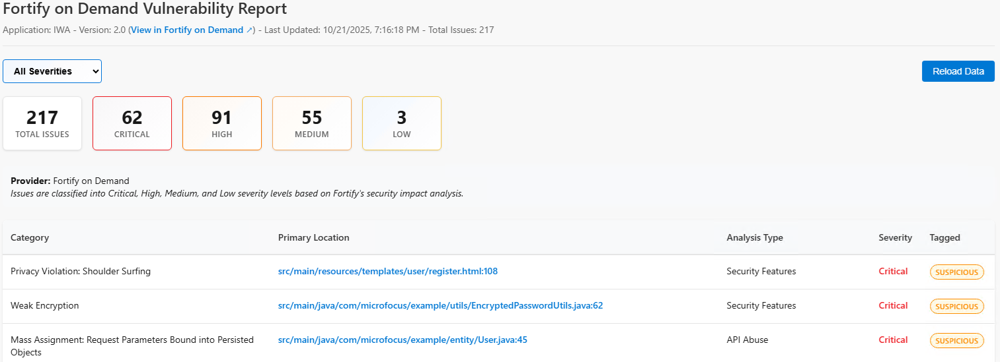
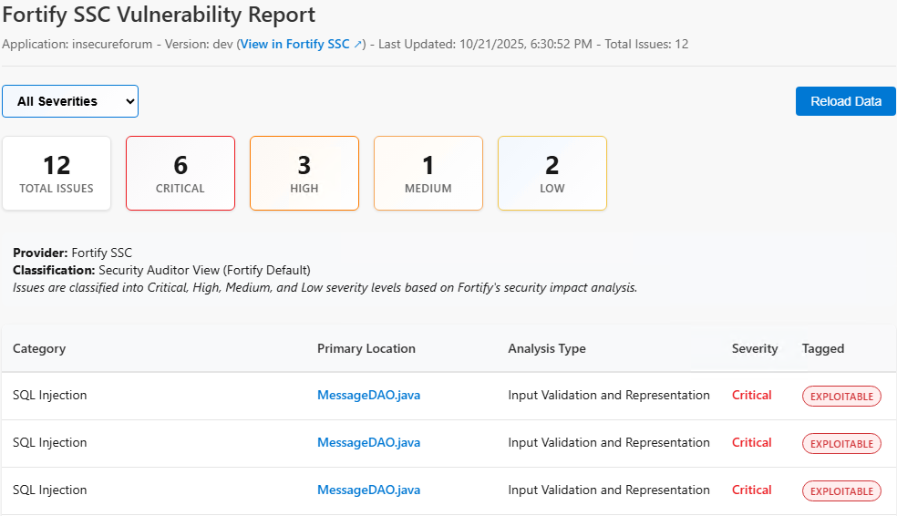

# Fortify Multi-Platform Report Extension

An Azure DevOps extension that integrates with both **Fortify Software Security Center (SSC)** and **Fortify on Demand (FoD)** to display security scan results directly in your build pipelines.

## Features

- ✅ **Multi-Provider Support**: Works with both Fortify SSC (on-premise) and Fortify on Demand (SaaS)
- ✅ **Unified Reports**: Consistent vulnerability reporting across both platforms
- ✅ **External Links**: Direct links to issues in your Fortify provider (with corrected URL format)
- ✅ **Filtering & Sorting**: Interactive report filtering by severity levels
- ✅ **FoD Region Selection**: Dropdown with 5 global FoD regions (AMS, EMEA, APAC, SGP, FedRAMP)
- ✅ **Accurate File Paths**: Correct file location display with proper line number formatting
- ✅ **Backward Compatible**: Existing SSC configurations work without changes

## Supported Providers

### Fortify Software Security Center (SSC)
- On-premise installations
- CI Token authentication
- Security Auditor View integration

### Fortify on Demand (FoD)
- Cloud-based SaaS solution
- API Key/Secret authentication with OAuth2
- 5 Global Regions: AMS (America), EMEA (Europe), APAC (Asia-Pacific), SGP (Singapore), FedRAMP
- Native severity classifications

## Quick Start

### For Fortify SSC Users
```yaml
- task: FortifyReport@17
  inputs:
    sscUrl: 'https://your-ssc-instance.com'
    ciToken: '$(FORTIFY_CI_TOKEN)'
    appName: 'MyApplication'
    appVersion: 'v1.0.0'
```

### For Fortify on Demand Users
```yaml
- task: FortifyReport@17
  inputs:
    providerType: 'fod'
    fodUrl: 'https://api.emea.fortify.com'  # Select from: ams, emea, apac, sgp, fed
    fodApiKey: '$(FORTIFY_API_KEY)'
    fodApiSecret: '$(FORTIFY_API_SECRET)'
    appName: 'MyApplication'
    appVersion: 'Release 1.0'
```

## Report Examples

### Fortify on Demand Report


### Fortify SSC Report


## What's New in Version 17.2

### Version 17.1 - Critical Bug Fixes
- 🔗 **Fixed FoD Issue URLs**: Now uses correct numeric issue ID format for external links
  - Correct: `https://emea.fortify.com/Releases/{id}/Issues/{numericId}`
- 🐛 **Fixed Issue ID Mapping**: Using proper numeric ID field from FoD API response

### Version 17.0 - UI and Configuration Improvements
- 🌐 **FoD Region Selection**: Dropdown with 5 global regions (editable for custom URLs)
- 📁 **Fixed File Path Display**: Correct file location with line numbers (no duplicates)
- 💬 **Provider-Aware Messages**: Loading messages now indicate which provider is being used
- 🏷️ **Tab Label Update**: Changed to "Opentext Application Security"

### Previous Versions
- 🚀 **Multi-Provider Architecture**: Complete rewrite supporting both SSC and FoD
- 🔐 **Enhanced Authentication**: Secure OAuth2 support for FoD with automatic token refresh
- 🎨 **Unified UI**: Consistent experience regardless of provider
- 🏗️ **Extensible Design**: Easy to add support for future Fortify platforms
- ✅ **Zero Breaking Changes**: Full backward compatibility for existing SSC users

## Configuration Details

### FoD Region Selection

When using Fortify on Demand, select from these predefined regions:

| Region | API URL |
|--------|---------|
| **AMS** (Americas) | https://api.ams.fortify.com |
| **EMEA** (Europe, Middle East, Africa) | https://api.emea.fortify.com |
| **APAC** (Asia-Pacific) | https://api.apac.fortify.com |
| **SGP** (Singapore) | https://api.sgp.fortify.com |
| **FedRAMP** (Government) | https://api.fed.fortifygov.com |

You can also enter a custom URL if needed.

### Common Task Parameters

| Parameter | Required | Description |
|-----------|----------|-------------|
| `appName` | ✅ Yes | Application name (must match exactly in provider) |
| `appVersion` | ✅ Yes | Version/Release name (must match exactly in provider) |
| `maxIssues` | No | Maximum issues to fetch (default: 10,000) |
| `skipValidation` | No | Skip connection validation (default: false) |

## Security & Best Practices

- Store sensitive tokens in Azure DevOps secure variables
- Use Azure Key Vault integration for enhanced security
- Regular token rotation recommended
- SSL/TLS encryption for all API communications
- API credentials are never logged or exposed in build output

## Support & Troubleshooting

**For Fortify on Demand:**
- Verify your API key and secret have `api-tenant` scope
- Check that your tenant allows API access
- Ensure application name and release name match exactly (case-sensitive)
- Use the test-fod-integration.js script for diagnostics

**For Fortify SSC:**
- Ensure CI token has appropriate permissions in SSC
- Verify application and version names match exactly
- Check SSC instance URL is accessible from build agent

For detailed troubleshooting, refer to the project repository or contact your Fortify administrator.